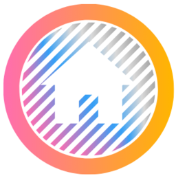

&nbsp;&nbsp;&nbsp;&nbsp;&nbsp;&nbsp;&nbsp;&nbsp;&nbsp;&nbsp;

<p align="center"> 

</p>


## With Mahallem you can share task in your house. Besides communicate with your neighbors.

[](https://travis-ci.com/guvense/Mahallem)
[](https://sonarcloud.io/dashboard?id=guvense_Mahallem-Backend)
[](https://codecov.io/gh/guvense/Mahallem)


[](https://mahallem.herokuapp.com/api/v1/app-info/version)

## Getting Started

These instructions will get you a copy of the project up and running on your local machine for development and testing purposes. See deployment for notes on how to deploy the project on a live system.

### Prerequisites

You need to install Java SDK 11 , Node.js and NPM, Maven, MongoDb, Redis, ElasticSearch


### Getting the project
```
git clone https://github.com/guvense/Mahallem-Backend.git
```

### Local development environment
A docker-compose file was prepared in order to setup 3th party applications. Redis, Mongodb and Elasticsearch.
In root directory,
```
docker-compose -f docker-compose.env.yml up -d
```
http://localhost:8081/api/v1/swagger-ui.html#/

### Unit Test method name convention 
  MethodName_StateUnderTest_ExpectedBehavior
  Your branch name should be unit-test/mah-<Issue Id>
 
## Authors
* **Guven SECKIN** [profile](https://github.com/guvense)
* **Gokhan YILMAZ** [profile](https://github.com/GokhanYilmaz44)
* **Sercan KAL** [profile](https://github.com/srcnkl)

See also the list of [contributors](https://github.com/guvense/Mahallem-Backend/graphs/contributors) who participated in this project.

## License

This project is licensed under the MIT License - see the [LICENSE.md](LICENSE.md) file for details

